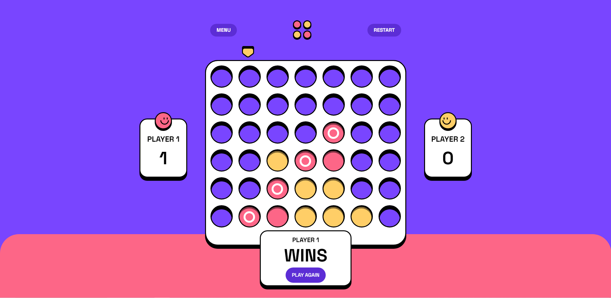

# Connect Four game

This is a solution to the [Connect Four game challenge on Frontend Mentor](https://www.frontendmentor.io/challenges/connect-four-game-6G8QVH923s). Frontend Mentor challenges help you improve your coding skills by building realistic projects.

## Table of contents

- [Overview](#overview)
  - [The challenge](#the-challenge)
  - [Screenshot](#screenshot)
  - [Links](#links)
  - [Built with](#built-with)
- [Author](#author)

## Overview

### The challenge

Users should be able to:

- View the game rules
- Play a game of Connect Four against another human player (alternating turns on the same computer)
- See hover and focus states for all interactive elements on the page
- See the discs animate into their position when a move is made

### Screenshot

### Links

- Solution URL: [https://www.frontendmentor.io/solutions/connect-four-game-GKYNsiROda](https://www.frontendmentor.io/solutions/connect-four-game-GKYNsiROda)
- Live Site URL: [https://connect-four-game-m1ctxyhbg-jinyoung5497.vercel.app/](https://connect-four-game-m1ctxyhbg-jinyoung5497.vercel.app/)

### Built with

- React
- Typescript
- React Redux
- Tailwind CSS

## Author

- github - [Jinyoung Choi](https://github.com/jinyoung5497)
- Frontend Mentor - [@jinyoung5497](https://www.frontendmentor.io/profile/yourusername)
